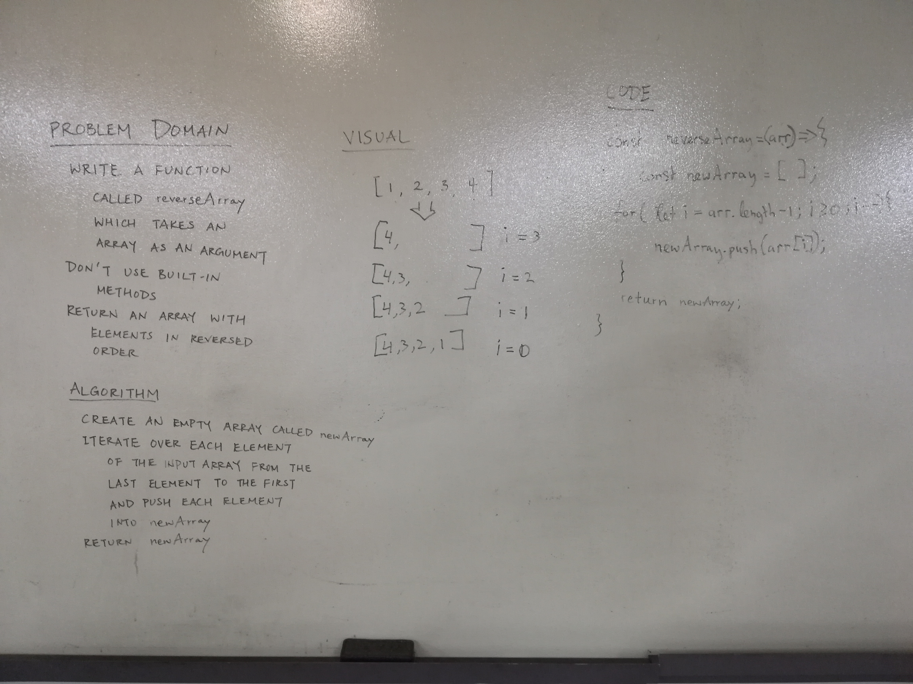

# Reverse an Array
<!-- Short summary or background information -->
Reversing an array.

## Challenge
<!-- Description of the challenge -->
Write a function called reverseArray which takes an array as an argument. Without utilizing any of the built-in methods available to your language, return an array with elements in reversed order.

## Challenge Partners
Trevor Stam & Katherine Smith

## Solution
<!-- Embedded whiteboard image -->

