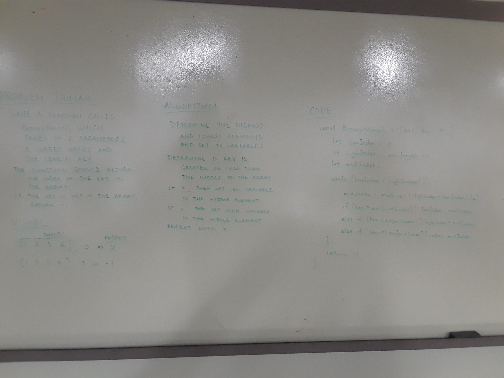

# Code Challenge 3

Binary search

### Code Partners
Trevor Stam  & Katherine Smith

## Challenge

Write a function called BinarySearch which takes in 2 parameters: a sorted array and the search key. Without utilizing any of the built-in methods available to your language, return the index of the array’s element that is equal to the search key, or -1 if the element does not exist.

## Solution
