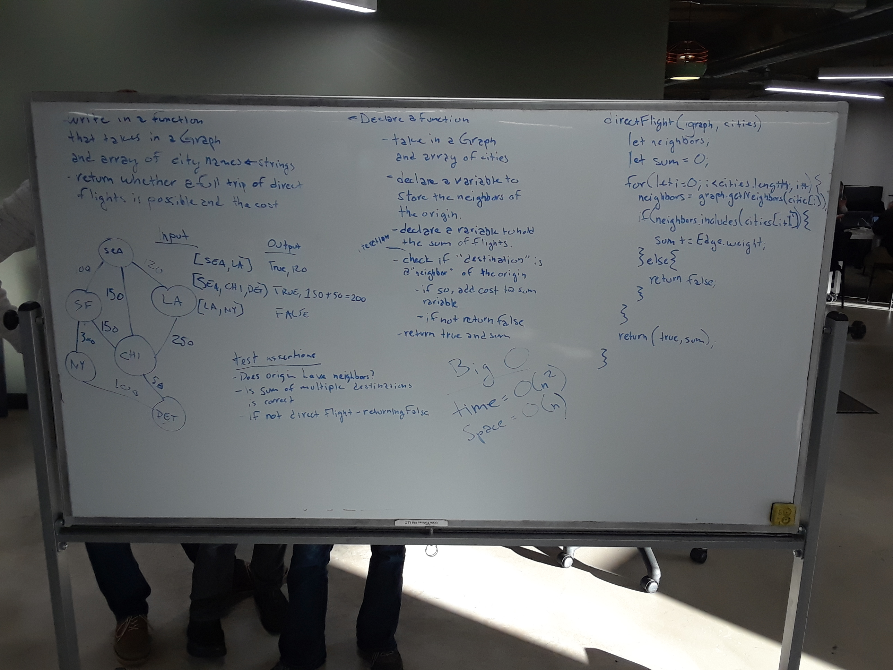

## Code Challenge 32

### Whiteboarding Partners
Ryan Milton & Trevor Stam

### Feature Tasks
Write a function based on the specifications above, which takes in a graph, and an array of city names. Without utilizing any of the built-in methods available to your language, return whether the full trip is possible with direct flights, and how much it would cost.

### Solution
