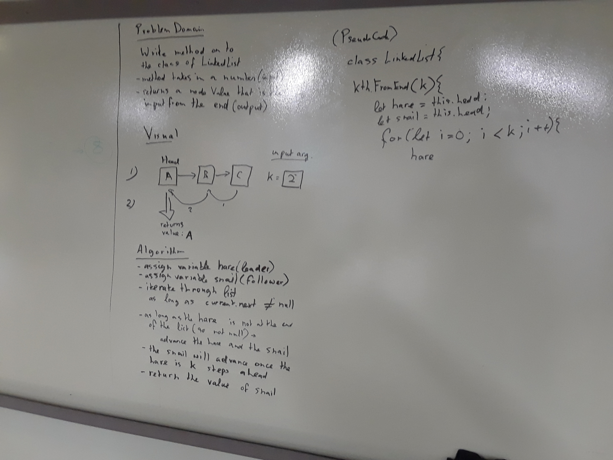

## Code Challenge: Linked Lists kth from the end

#### Partners
Trevor Stam & Ryan Milton

### Challenge
Write a method for the Linked List class which takes a number, k, as a parameter. Return the node’s value that is k from the end of the linked list. You have access to the Node class and all the properties on the Linked List class as well as the methods created in previous challenges. ​ 

### Whiteboarding Solution

