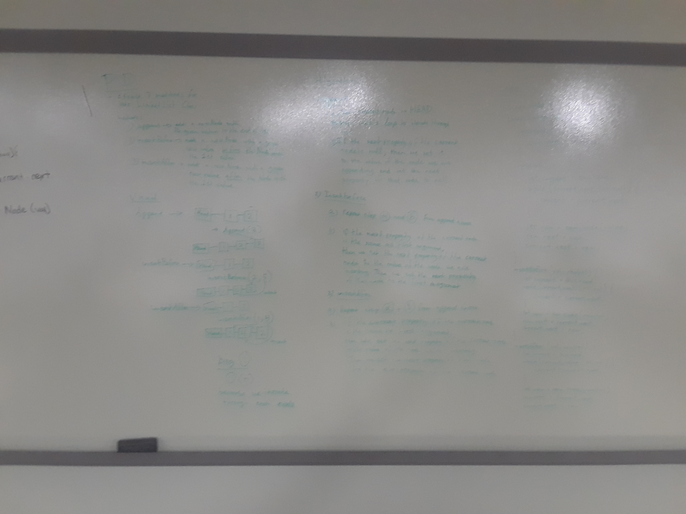

## Code Challenge: Linked List Insertions

#### Whiteboarding partners:
Trevor Stam & Katherine Smith

### Feature Tasks:
Write the following methods for the Linked List class:

  - .append(value) which adds a new node with the given value to the end of the list
  - .insertBefore(value, newVal) which add a new node with the given newValue immediately before the first value node
  - .insertAfter(value, newVal) which add a new node with the given newValue immediately after the first value node

### Test requirements:
Write at least three test assertions for each method that you define.
Ensure your tests are passing before you submit your solution.

### Whiteboard Solution:

