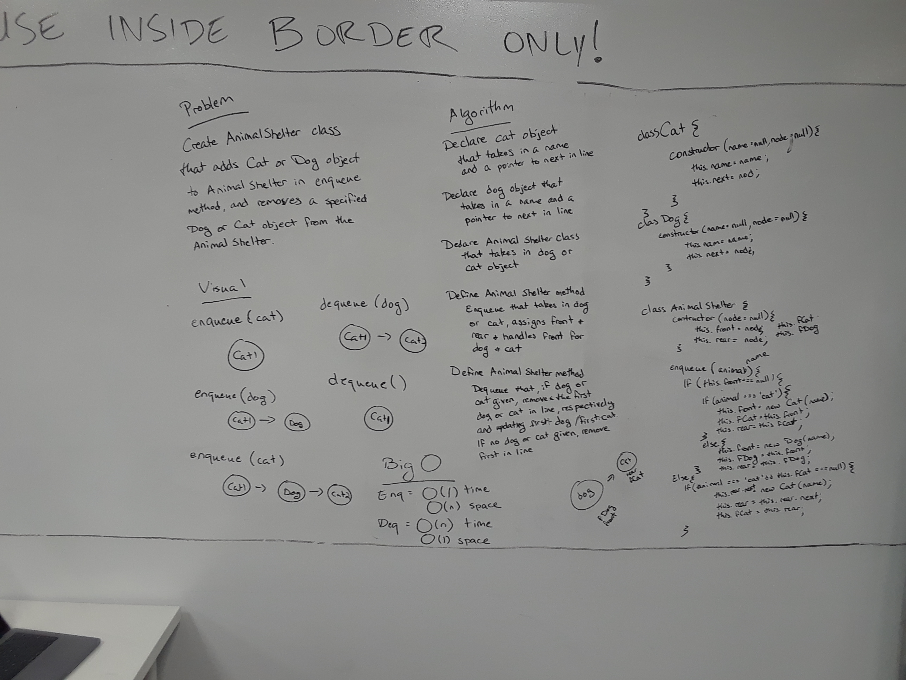
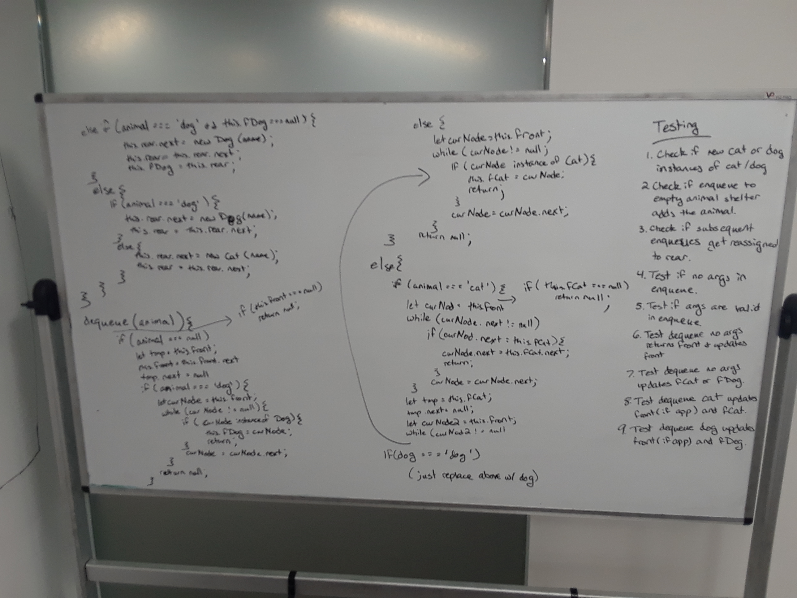

## Code Challenge: First in First Out Animal Shelter

#### Whiteboard partners
Trevor Stam & Jen Carrigan

### Challenge

- Create a class called AnimalShelter which holds only dogs and cats. The shelter operates using a first-in, first-out approach.
- Implement the following methods:
  - enqueue(animal): adds animal to the shelter. animal can be either a dog or a cat object.
  - dequeue(pref): returns either a dog or a cat. If pref, a string, is ‘cat’ return the longest-waiting cat. If pref is ‘dog’, return the longest-waiting dog. For anything else, return either a cat or a dog.

### Solution
note: There are 2 photos. 1st with problem domain , visual , algorithm, big (O) notation and first part of the code. The 2nd photo has the second part of the code plus the testing.

