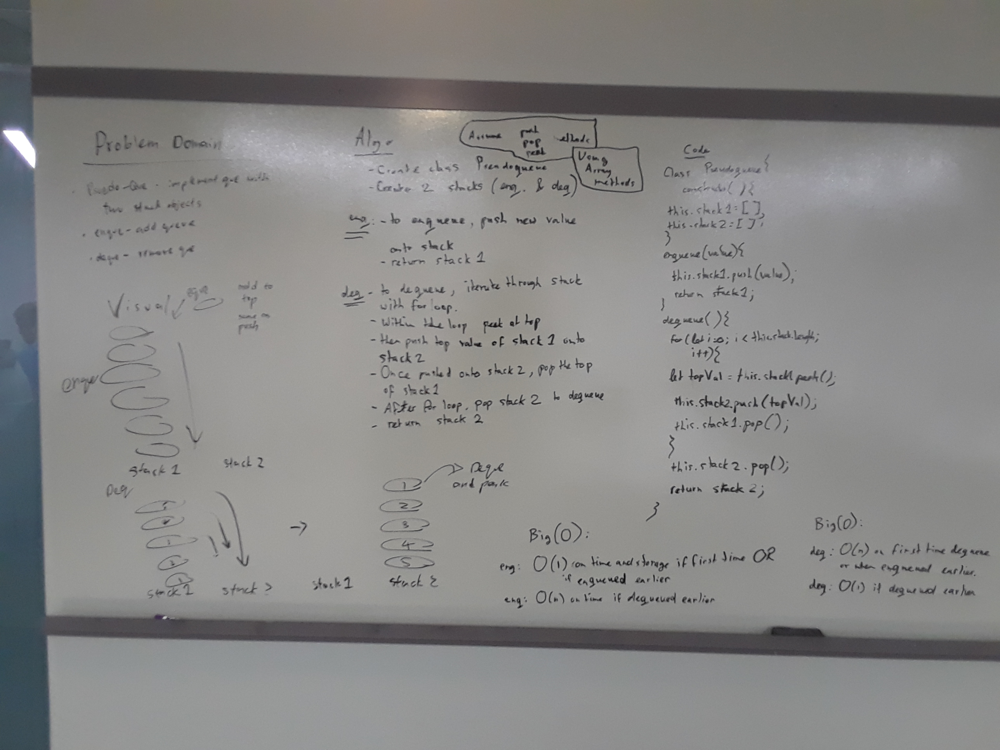

## Code Challenge Queues with Stacks

#### Whiteboarding partners
Timothy Li & Trevor Stam

### Challenge
Create a brand new PseudoQueue class. Do not use an existing Queue. Instead, this PseudoQueue class will implement the standard queue interface, but will internally only utilize 2 Stack objects. Ensure that you create your class with the following methods:

  - enqueue(value) which inserts value into the PseudoQueue, using a first-in, first-out approach.
  - dequeue() which extracts a value from the PseudoQueue, using a first-in, first-out approach.

The Stack instances have only push, pop, and peek methods. You should use your own Stack implementation. Instantiate these Stack objects in your PseudoQueue constructor.

### Whiteboard
