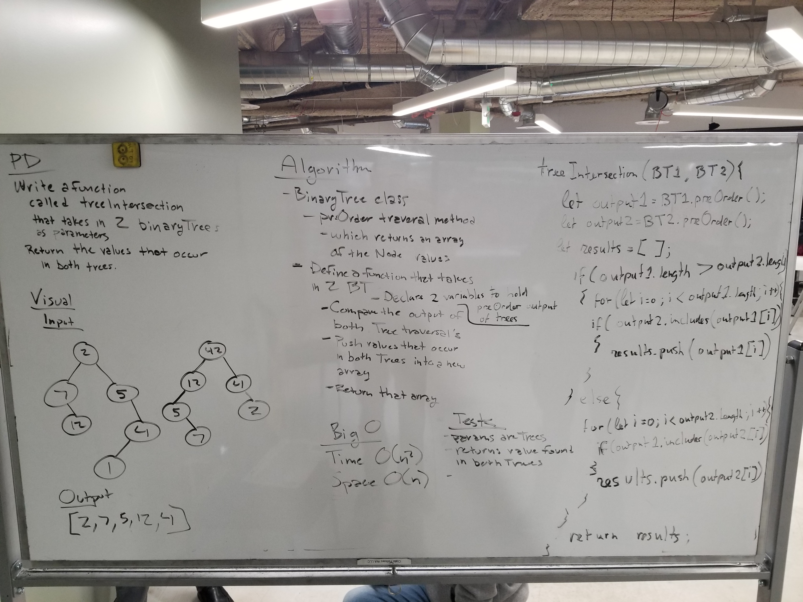

## Code Challenge 27: Tree intersection

### Whiteboard Partners
Ryan Milton & Trevor Stam

### Challenge
  - Write a function called tree_intersection that takes two binary tree parameters.
  - Without utilizing any of the built-in library methods available to your language, return a set of values found in both trees.

### Solution

