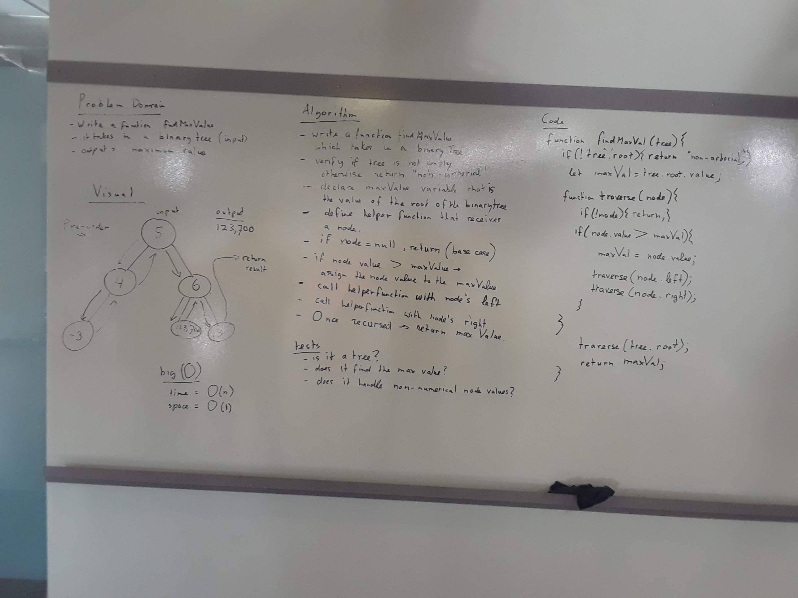
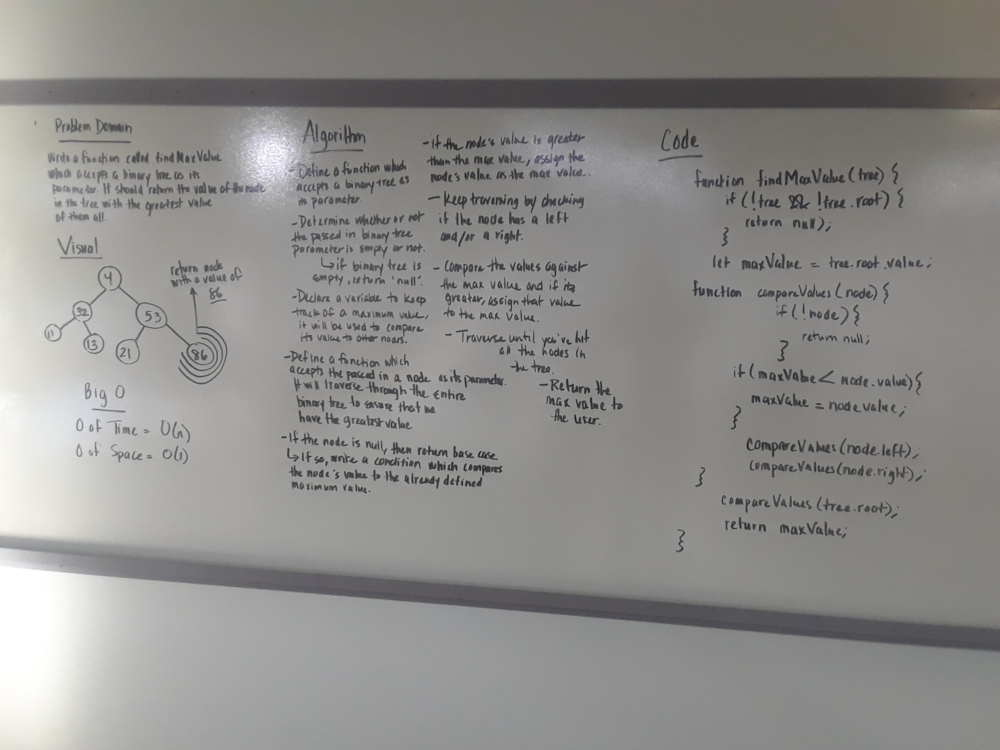

## Code Challenge 18: Find the Maximum Value in a Binary Tree

### Whiteboard Partners:
Trevor Stam, David Chambers, Ben Harris, George McCadden

Note: George came in later due to an interview. I volunteered to walk him through his whiteboard, so I'm submitting 2 solutions below

### Challenge
Write a function called find-maximum-value which takes binary tree as its only input. Without utilizing any of the built-in methods available to your language, return the maximum value stored in the tree. You can assume that the values stored in the Binary Tree will be numeric.

### Whiteboard Solutions

