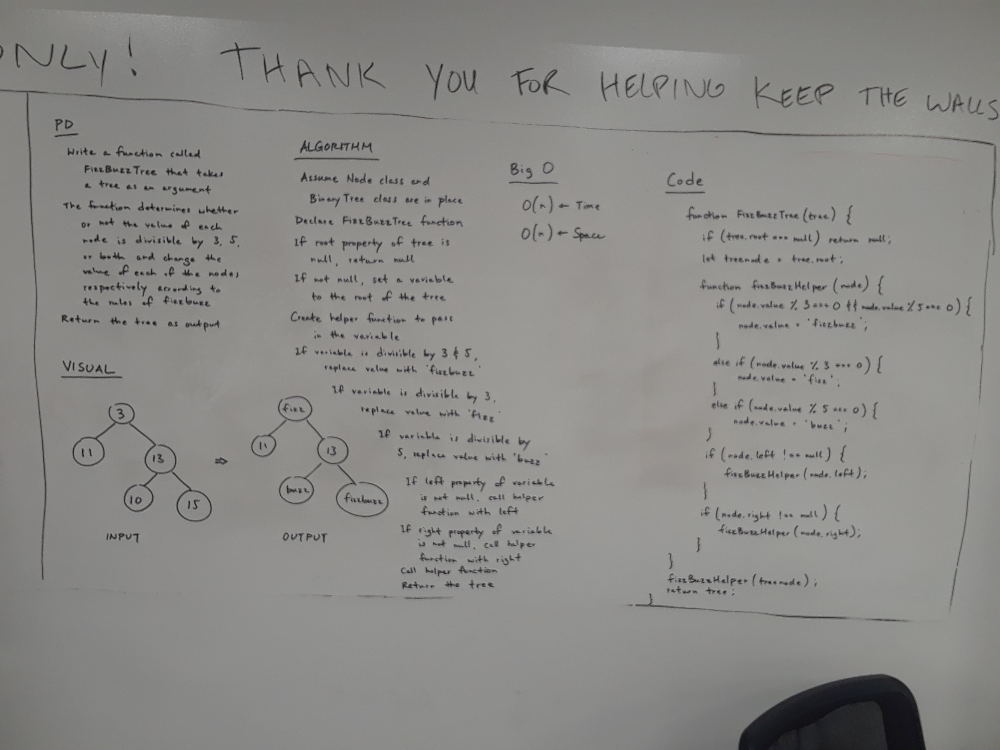

## Code Challenge: Fizz Buzz Tree

### Whiteboarding partners
Katherine Smith & Trevor Stam

### Challenge
- Write a function called FizzBuzzTree which takes a tree as an argument.
- Without utilizing any of the built-in methods available to your language, determine whether or not the value of each node is divisible by 3, 5 or both, and change the value of each of the nodes respectively. Return the tree with it’s news values.

### Whiteboarding solution

